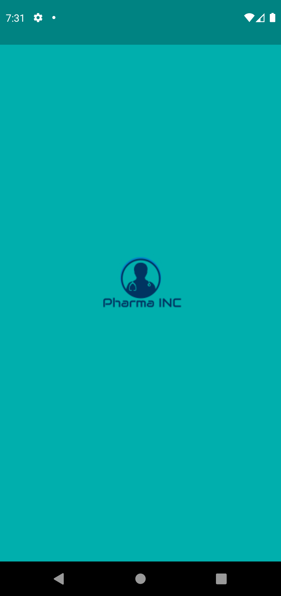

# Usuários Pharma Inc.

## Introdução

Este é o aplicativo desenvolvido como solução ao Mobile Challenge 2021 da Coodesh, e é constituído por um consumo de API de dados de usuários. A interface exibe uma lista de usuários, e apresenta a opção de carregamento de mais usuários em um botão ao final da lista. Ao clicar em um usuário, é apresentada uma lista com suas características detalhadas. Também há opções de filtrar os usuários por país e por gênero.

## Linguagem, framework e tecnologias utilizadas.

* Linguagem Dart;
* Framework Flutter;
* Dependências:
    * intl (inserção de padrões internacionais de data);
    * http (realização de requisições http);
    * provider (utilização de gerenciador de estado Provider).

## Instruções

1. Clonar o repositório;
2. Baixar e instalar o framework Flutter
2. Baixar e instalar o Visual Studio Code e a extensão do framework Flutter;
3. Baixar e instalar o Android Studio e configurar emulador mobile, caso deseje;
4. Verificar a configuração do Flutter, rodando flutter doctor no prompt de comando;
5. Abrir o repositório e executar sem depuração, na linguagem Dart e utilizando o emulador ou navegador web.

